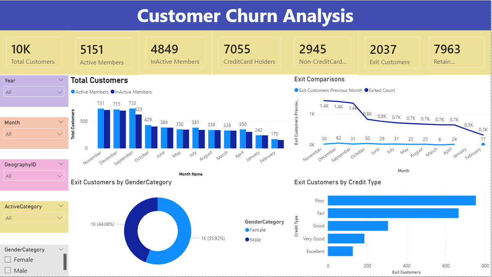

# Customer Churn Analysis

## Objective
The main objective of this project is to analyze customer data from the bank, covering details like demographics, account activities, and credit information. This helps in understanding customer behavior, identifying patterns, and supporting strategies to improve customer satisfaction and loyalty.

## Project Highlights
This project focuses on key aspects such as customer engagement, credit card usage, and account activity. These parameters help the bank to identify which customer groups are active, which need more attention, and how overall engagement can be improved.

## Dashboard Visualization
 

## Dashboard Insights
### 1.Total Customers:
The dashboard provides a baseline understanding of the total customer base.

### 2.Active/Inactive Members:
This segmentation helps identify customers who are still engaged with the business versus those who are inactive.

### 3.Credit Card Holders:
This information is valuable for understanding payment preferences and potential churn factors related to payment methods.

### 4.Customer Activity Chart
This chart represents the proportion of active and inactive customers. It visually highlights how customer engagement levels vary within the bank.

### 5. Monthly Trend Chart
The trend chart shows how customer behavior changes month by month. It helps in identifying specific months with higher or lower activity or exits, giving insights into seasonal or operational factors.

### 6. Gender Distribution Chart
This chart illustrates the distribution of customers based on gender. It helps to understand the balance between male and female customers and how their engagement levels differ.

### 7.Credit Score Category Chart
This visualization represents customers grouped by their credit score levels such as “Good,” “Very Good,” and “Excellent.” It helps the bank identify which credit groups are more likely to remain active or inactive.

## DAX Formulas Used
* Total Customers = COUNT(CustomerInfo[CustomerId])
* Active Members = CALCULATE(COUNT(Bank_Churn[IsActiveMember]),Bank_Churn[IsActiveMember]=1)
* InActive Members = CALCULATE(COUNT(Bank_Churn[IsActiveMember]),Bank_Churn[IsActiveMember]=0)
* CreditCard Holders = CALCULATE(COUNT(Bank_Churn[HasCrCard]),Bank_Churn[HasCrCard]=1)
* Non-CreditCard Holders = CALCULATE(COUNT(Bank_Churn[HasCrCard]),Bank_Churn[HasCrCard]=0)
* Retain Customers = CALCULATE(COUNT(Bank_Churn[Exited]),Bank_Churn[Exited]=0)
* Exit Customers = CALCULATE(COUNT(Bank_Churn[CustomerId]),Bank_Churn[Exited]=1)
* Exit Customers Previous Month = CALCULATE([Exit Customers],PREVIOUSMONTH(Bank_Churn[Bank DOJ].[Date]))
* Exited Count = COUNT(Bank_Churn[Exited])

## Conclusion 
The project highlights how visual analytics can help the bank better understand its customers and make data-driven decisions. To improve business outcomes based on this analysis:

* Increase engagement programs to encourage inactive customers.
* Focus on improving service experience to retain customers with good credit profiles.
* Conduct periodic feedback surveys to identify satisfaction levels and areas needing attention.
* Strengthen personalized offers and communication to build long-term relationships.
### These improvements will help the bank enhance customer satisfaction, reduce customer exits, and build stronger customer loyalty over time.
