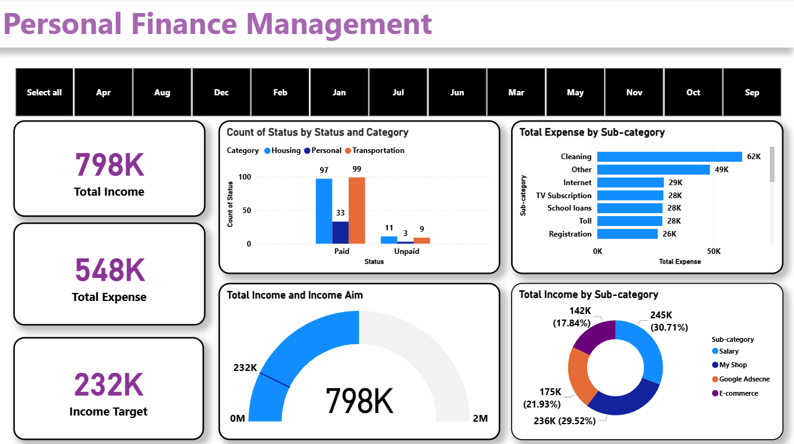

# Finance Management Analysis

## Overview
This project analyzes an overall financial health by comparing Total Income, Total Expense, and Income Target over a year. The goal is to understand income composition, spending behavior, and how effectively financial goals are being met, including transaction management and income performance evaluation.

### Project Highlights
* Total Income: High and exceeds the set target
* Total Expense: Noticeably lower than total income
* Income Target: Achieved and surpassed significantly

### Dashboard Visualization 
 

## Dashboard Insights
### 1) Financial Overview
Income levels are strong with a clear surplus after expenses, indicating good financial control. This shows effective budgeting and efficient management of both earnings and expenditures.

### 2) Income vs Target
The income achieved is far above the target, reflecting excellent performance. This highlights successful financial planning and consistent revenue growth throughout the year.

### 3) Income Sources
Major contributors include Salary, My Shop, E-commerce, and Google Adsense, showing a well-diversified income portfolio. Such diversification reduces financial risk and ensures stable income from multiple reliable sources.

### 4) Spending Distribution
The highest expense is Cleaning, followed by Other categories and consistent spending on Internet, TV Subscription, School Loans, Toll, and Registration. This pattern suggests a balanced spending approach with focus on essential and recurring costs.

### 5) Transaction Status
Most payments are completed, but some are still Pending or Unpaid, indicating areas to improve payment follow-up and liquidity. Timely clearing of pending transactions will strengthen cash flow and improve overall financial efficiency.

## Dax Formulas Used 
* Status Count = COUNT('Main Data'[Status])
* Total Target = SUM('Income Goal'[Income Target])
* Total Income = CALCULATE(SUM('Main Data'[Amount]),KEEPFILTERS('Main Data'[Income / Expense]="Income"))
* Total Expense = CALCULATE(SUM('Main Data'[Amount]),KEEPFILTERS('Main Data'[Income / Expense]="Expenses"))

## Conclusion 
The analysis indicates a very strong financial position, with Total Income far outstripping Total Expense and greatly exceeding the Income Target. Income is well-diversified across multiple stable streams, and spending is mostly concentrated on essential services such as Cleaning and general maintenance. To further improve financial performance, the following steps are recommended:

* Break down and categorize the large “Other” expenses to distinguish discretionary from necessary costs.

* Resolve pending and unpaid transactions to enhance liquidity.

* Strategically allocate excess income toward savings, investments, or long-term wealth-building plans.

* Review high-cost areas like Cleaning services for more cost-effective alternatives without reducing quality.

### These actions will strengthen financial stability, enhance control over transactions, and ensure the individual’s long-term financial growth and sustainability.
