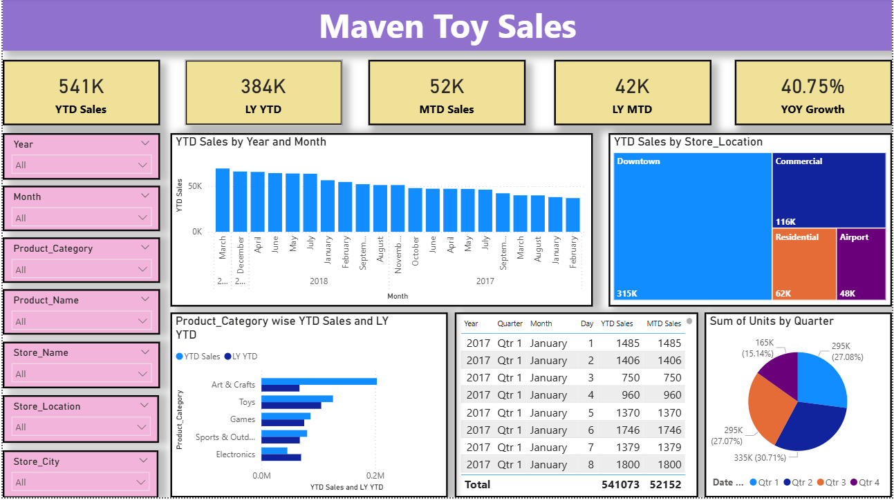

# Maven Toy Sales Analysis

## Objective 
The main objective of this project is to analyze toy sales performance across various product categories, store locations, and time periods. This analysis helps to monitor annual growth, identify high-performing store environments, and seasonal sales trends to support data-driven decisions for inventory stocking, regional marketing strategies, and revenue forecasting.

## Project Highlights 
This project analyzes sales performance across diverse product categories, store environments, and timeframes. The dataset encompasses detailed metrics such as Year-to-Date (YTD) revenue, unit volumes, and comparative growth figures against previous years. The dashboard features high-level KPI cards for immediate performance tracking, a treemap for geographic revenue distribution, and categorical bar charts to benchmark product success. Additionally, a quarterly unit breakdown and a granular date-level table are included to visualize seasonal demand. These visuals work together to provide a clear understanding of how regional placement and seasonal timing contribute to the company's overall year-over-year growth.

## Dashboard Visualization 
 

## Dashboard Insights 
### 1.KPI Cards :
Summarizes the highest-level business health metrics, including total year-to-date revenue, past performance, and year-over-year growth rate.

### 2.YTD Sales by Year and Month :
Tracks monthly sales volume chronologically to help identify seasonal trends and peak revenue periods.

### 2.YTD Sales by Store_Location :
Breaks down total revenue by physical store environment, visually emphasizing the heavy sales dominance of the Downtown locations.

### 3.Product_Category wise YTD Sales and LY YTD :
Compares current year sales directly against the previous year for each category to highlight growth or decline in specific product lines.

### 4.Sales Data Matrix :
Provides a highly granular, day-by-day numerical record of sales metrics for precise auditing and daily performance tracking.

### 5.Sum of Units by Quarter :
Illustrates the percentage breakdown of total physical units sold across the four quarters to highlight volume distribution throughout the year.

## Dax Formulas Used
* YTD Sales = TOTALYTD(SUM(sales[Units]),sales[Date])
* LY YTD = CALCULATE([YTD Sales],SAMEPERIODLASTYEAR(sales[Date]))
* MTD Sales = TOTALMTD(SUM(sales[Units]),sales[Date])
* LY MTD = CALCULATE([MTD Sales],SAMEPERIODLASTYEAR(sales[Date]))
* YOY Growth = (CONCATENATE(ROUND(DIVIDE([YTD Sales]-[LY YTD],[LY YTD])*100,2),"%"))

## Conclusion 
This analysis indicates substantial business growth, highlighted by a strong 40.75% year-over-year increase in overall sales. Product categories like Art & Crafts and Toys continue to perform exceptionally well compared to last year's metrics, while categories like Electronics offer potential for growth through targeted promotions. Sales performance is heavily concentrated in Downtown locations, suggesting a highly profitable urban customer base. To further improve performance based on this analysis:

* Certain product lines and store locations drive significantly higher sales, indicating key areas for sustained revenue growth.

* Geographic sales distribution shows a clear dominance in Downtown stores, presenting an opportunity to either expand urban presence or run localized promotions for Residential and Airport branches.

* Time-based sales trends and quarterly unit breakdowns highlight peak periods (such as Q2, March, and December) for targeted seasonal marketing and optimized inventory management.

* Focusing on high-performing product categories and localized retail strategies can improve overall business operations and profitability.

### These actions will help the company enhance revenue, optimize seasonal supply chains, and strengthen its market position across all store locations.
