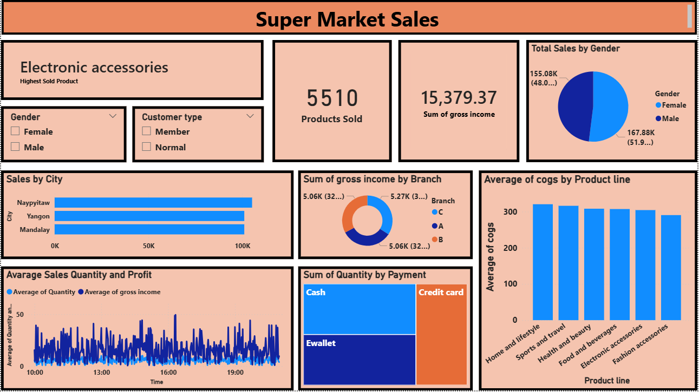

# SuperMarket Sales Analysis

## Objective
The main objective of this project is to analyze the supermarket’s sales performance across different product lines, customer segments, payment methods, and branches. This analysis helps to understand customer behavior, identify sales trends, and support better decision-making for marketing, operations, and inventory management.

## Project Highlights
The project analyzes key areas including product performance, customer purchasing behavior, and sales trends across different locations. The dataset includes details on product categories, payment types, customer ratings, and sales timing. The dashboard features KPI cards, product line charts, payment method breakdowns, and location performance visuals. These visuals help in understanding how each factor contributes to overall business performance.

   

## Dashboard Insights
### 1.Total Sales by Gender
This Chart shows Female customers contribute more to the total sales revenue compared to male customers While the split is relatively balanced, marketing efforts targeting female shoppers may yield slightly higher returns.

### 2.Sales by City
Sales are remarkably consistent across the three major cities, with only minor variations where Naypyitaw leads the pack, followed closely by Yangon, with Mandalay trailing slightly behind. All three cities are around the 100K sales mark.

### 3.Sum of Gross Income by Branch
Profitability is distributed almost equally among the three branches A, B, and C where No single branch is significantly underperforming, suggesting a stable operational model across locations.

### 4.Average of COGS by Product Line
This chart shows the Cost of Goods Sold (COGS) for different categories.Here Home and lifestyle,Sports and travel have the highest average COGS (exceeding 300) where as Fashion accessories has the lowest average COGS.Even though Electronic Accessories are the "Highest Sold," they fall in the middle of the pack regarding unit cost.

### 5.Sum of Quantity by Payment
This chart visualizes which payment methods are most popular for moving product volume.Here Cash is the most used payment method, followed by Ewallet and Credit card usage represents the smallest portion among the three Payments.

### 6.Average Sales Quantity and Profit by Time
This tracks performance throughout the day (from 10:00 to 19:00).Here Gross income (dark blue) shows high volatility with significant spikes, particularly around 13:00 and 16:00 (4:00 PM).

## Dax Formulas Used
* Gross Income = SUM(Sales[gross income] 
* Product Sold = SUM('Sales'[Quantity]) 

## Conclusion
The analysis indicates that both online and offline sales show stable performance across all branches and cities. Product lines like Electronic Accessories and Food & Beverages continue to perform well, while other categories offer potential for growth through targeted promotions. Customer satisfaction levels are strong, and the balanced gender ratio suggests wide customer appeal. To further improve performance based on this analysis:

* Certain product lines drive higher sales, indicating key areas for revenue growth.

* Customer purchasing behavior and payment preferences are balanced, showing flexibility in transactions.

* Time-based sales trends highlight peak periods for targeted promotions and optimized staffing.

* Focusing on high-performing products and operational strategies can improve overall business performance and profitability.

#### These actions will help the supermarket enhance profitability, improve customer satisfaction, and strengthen its position across both online and offline sales channels.
